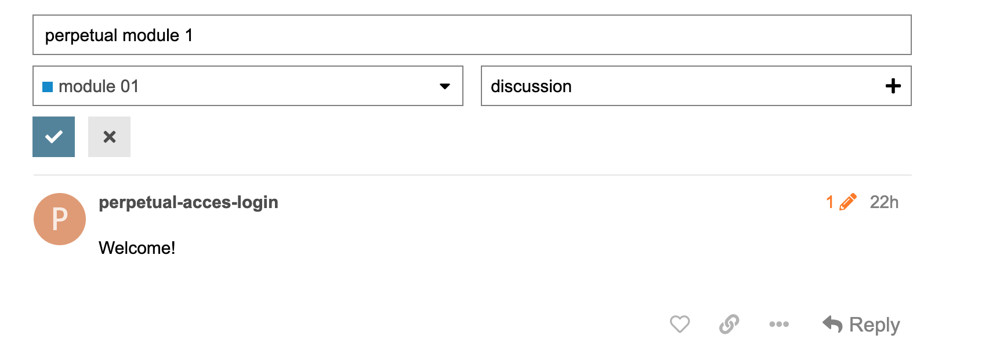

# englishes mooc

a massive online open course about art englishes. 

running on [Kirby](https://getkirby.com/) + [Discourse](https://www.discourse.org/) for the backend, and [choo](https://choo.io/) for the frontend.

## setup

the website runs on a VPS running Debian. on it, the Discourse software is setup following the official instructions, which suggests to run it all inside a Docker container. see [How Do I Install Discourse?](https://github.com/discourse/discourse/blob/main/docs/INSTALL.md).

the other piece of software is a custom website made with Kirby and choo. Kirby is an easy to use CMS written in PHP, which stores content in files and folders. choo was (ahem) a "micro" javascript framework to build single-page applications.

for the most part, every action (HTTP request) happening on the frontend and done with choo, is the sent to Kirby, which eventually — if it's the case — sends it down to Discourse. overall, Discourse acts as the main source of activity for the website. eg. every course in the MOOC takes place in Discourse, and is then displayed in the frontend website via Kirby and choo.

## maintenance

the codebase has been produced for the most part in about 10 days. due to this time pressure and combined with almost zero budget to keep the software stack up-to-date and somewhat legible long-term, the code has zero documentation (except some inline comment in the codebase).

generally speaking though, here are the steps to follow:

1. periodically update Discourse
2. periodically update Kirby
3. periodically check for npm vulnerabilities for dependencies part of choo

### 1. Discourse

Discourse sends out emails whenever a new release has been published, to the email address set as Admin (check Discourse settings).

it is a one-click update procedure (the installer will be opened on a webpage, you'll follow on-screen instructions).

the other way to do it, is to SSH into the VPS and run the one-line shell command to update the Discourse software.

the major source of problems with Discourse has been the often (at the time) constant change of their APIs in regards to "third-party" software (like ours) to interact with Discourse. in particular, in our case, with how user login authentication works. since we haven't updated Discourse in years, things are still working for the time being and hopefully they haven't changed their APIs for that area. in case they did, the only way to find things out was to browse the Discourse's own [Discourse forum](https://meta.discourse.org).

`Discourse` cannot be found directly in the codebase, but only on the VPS.

### 2. Kirby

Kirby hasn't been updated in years too — it's still at the first `3.0` release. 
To update it, follow [this guide](https://getkirby.com/docs/guide/updates).

`Kirby` can be found in the codebase under `./public`.

### 3. choo

choo has stopped being actively developed and as well maintained. as with any javascript / node.js project, check for updates with: 

```
npm update
```

`choo` can be found in the codebase under `./app`.

## usage

### create new forum user

the only on-going operation that's been done after the putting-together of the website, is the creation of new forum users for Discourse.

following, the steps to create a new forum user account that integrates with the website (eg, it can be used to login directly form the frontend, main website):

1. make sure to use a fresh email address, not already registered in the Forum
2. login to <https://forum.englishes-mooc.org> with an Admin accountm, then:
   - click on the three-lines menu (top-right) and click on Settings
   - click on the `Users` tab (next to the `Settings` tab)
   - click on the `Send Invites` button one row below the Users tab
3. click on the "Invite" button and fill out the email address from above (1.)
  - this might require making a new email account from an email service
  - then, accept the Forum invitation that you should have received from the fresh email address (1.)
  - test the Forum invitation by logging-in to the Forum!
4. afterwards, while still being logged-in as an Admin user in the Forum, browse to this URL <https://forum.englishes-mooc.org/admin/api/keys> and create a "New API Key":
   - `Description`: put something clear, eg. "User frontend"
   - `User Level`: single user
   - `Scope`: global

**Very important**: after you clicked on the Save button, copy the API Key value somewhere safe.

**Very important**: after you clicked on the Save button, make sure to copy the URL from the web-browser:

- eg. `https://forum.englishes-mooc.org/admin/api/keys/155`

we will need it in the next step. 

In case you did not manage to save the URL after clicking on Save, you can get back the same value from this URL <https://forum.englishes-mooc.org/admin/logs/staff_action_logs>, by checking the *details* column of the last action in the list (top of the list). you can make sure you are copying the right message, by making sure that  the API key value in the *details* column is the same as the one you copied somewhere after you hit the Save button while completing this step (4.).
   
5. login to Kirby via <https://englishes-mooc.org/panel/> and browse to this URL <https://englishes-mooc.org/panel/pages/forum-users>:
   - add a new Entry in the table using the Add button on the top right, with the following:
	 - `Name`: the name of the Forum user (the `username` version, you can check it here https://forum.englishes-mooc.org/admin/users/list/active)
	 - `Username`: same as above
	 - `API Key`: the key you just created in step 4.
	 - `email`: the email address you picked for the user in step 1.
	 - `password`: leave it empty
	 - `ID`: the value from step above (4.): copy the last part of the URL, eg `155`. if you used the Logs page (<https://forum.englishes-mooc.org/admin/logs/staff_action_logs>) to retrieve this info, you want to copy the `id` part from it.
   - click on Add and you're done

6. you should now be able to test the new user login by logging-in to the main website via the sidebar and the Login button.

### how to display a new Forum thread in the frontend website

when adding a new Topic in the Forum (via Discourse), make sure that it has:

- as category, one of the modules available, eg `module 02`
- as tag, the tag `discussion`

if you set the tag to something other than `discussion`, the frontend website will never display the messages of that Topic in the website's Forum sidebar. so always set the tag `discussion` to a new Topic.

see screenshot below for reference:


